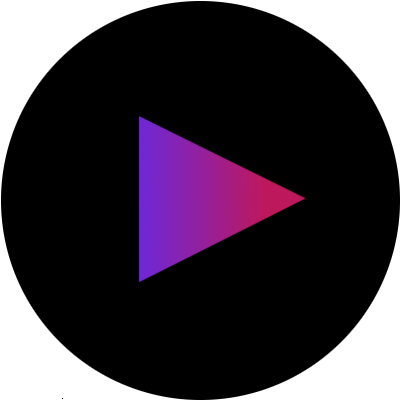
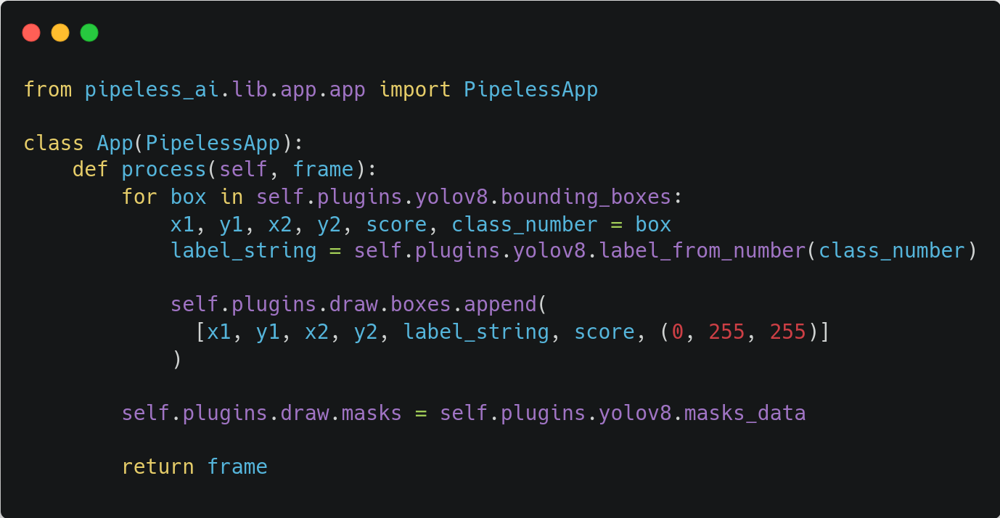

<p align="center">
  <a href="https://pipeless.ai">
    <picture>
      <source media="(prefers-color-scheme: dark)" srcset="assets/pipeless-400x400-rounded.png">
      
    </picture>
    <h1 align="center">Pipeless</h1>
  </a>
</p>

<p align="center">
  <a aria-label="Pipeless logo" href="https://pipeless.ai">
    
  </a>
  <a aria-label="Python version" href="https://pypi.org/project/pipeless-ai/">
    
  </a>
  <a aria-label="License" href="https://github.com/miguelaeh/pipeless/blob/main/license.md">
    
  </a>
  <a aria-label="Join the community on GitHub" href="https://github.com/miguelaeh/pipeless/discussions">
    <img alt="" src="https://img.shields.io/badge/Join%20the%20community-blueviolet.svg?style=for-the-badge&logo=data%3Aimage%2Fpng%3Bbase64%2CiVBORw0KGgoAAAANSUhEUgAAACEAAAAgCAYAAACcuBHKAAAKVHpUWHRSYXcgcHJvZmlsZSB0eXBlIGV4aWYAAHja7ZhZkiM5DkT%2FeYo5AjcQ5HG4ms0N5vjzQEVu1dVTS%2FfXWKcsFYtCJAh3OJxy%2Bz%2F%2FPu5f%2FKWs0WXRWlopnr%2Fccoudk%2Bpff%2BO%2BB5%2Fv%2B%2F2Lz5HrL%2FddfO77yK3EMb0u29sHm%2Fuch%2Be6PZOEt%2BffBno7CZ0z%2Bfig9%2Bf%2B%2BHp%2FPAPG%2Bu1ATwQpvGb26%2FnCM1CKT0T5dT2fiEqr%2BmVpaz4z5%2BdW%2FfjPSWOREjTznqNXLY3zGn1W8rks0DNjuwPJK6HvN96u3x6NxBR3CsnzntITZbL%2FlDrHdt8DyeahzEXkZe%2F1Jt4DJSEQaXsm6v49mZ9z85GjP%2Fn7mWV5JjnbHv6E2vvxG968n33Dm1O%2F0uYdtVqeR9JXWH15P373fpC3gd4%2BSO%2Fzx88z1%2Fmcxa%2F3WdL4nAr3Ge5zVj130ayi50IuyrOotyXeM54blsX7rcJLfXGwtnJir8ar%2Bu4nnFp%2BMuPgvIUI9ifksEIPJ%2Bx7nGESYo47KscYp4vp3qyA1OJMLzLwCicqHFmpQol5OZRTfI8l3GnbnW6G6pfzK%2FBoDAwWLpd%2B8%2BV%2B9sFzrJZCuLmsN1fEFeNVFrII%2FHbgMRAJ50mq3AS%2Fvb79M1wTCMpNc2WB3Q%2F3GmJI%2BCBXukAnHhSOr6oPup4BSBFTC8GEBAK%2BhCShEJHGqCGQyApAndBjynGAQBCJiyBjTqkADtXB3HxHw300SnzdRlVTdklSSQo2VDFg5SzwR3OFQ12SZBEpolKlSS%2BpWOWVosXkuWvSrKJFVavTpr2mmqvUUrXW2mpvsSXkWxp12mprrXcm7Yzc%2BXbngd5HHGnkIaMMHXU0N%2FqEPjNPmWXqrLPNvuJKiwJfZemqq62%2Bw4ZKO2%2FZZeuuu%2B1%2BoNpJJx855ag79bTT31F7YP3D6xdQCw9q8SJlD%2Bo7atxVfRsimJyIYQZiMQcAV1ADMYhtmPkaco6GnGFGP6IqJBKkGDgrGGIgmHeIcsI7dg9yjiz%2BLbg5rRe3%2BFeRcwbdTyL3R9y%2Bh9qyLjEvYq8ytKT6RPXx%2Ba491m7t9U%2BP7kcP%2FOzxn4H%2BhoEgXBiwYVBZmRaQN56gxShr7gG3pwrCNYeLQzbQS60vjGnn%2FY7zi0dXf%2FOL1cdTmpQT11yLLpLzGK1Sy3XWMEuWUuFuPboPCjFsPftsoyxtdSWdcZwTQ256WFqDyb6V0bfDsmxri6cuHYuxaJ%2BjBOhfTm9LMkXVKEwraip57CpUdjNPkeoZe5ydrKpdjblq2CXuNU%2FeOfRNCcUZZdSaTWAomJFmS1JHp6R17y08UmajkVNxU9dY3Y12QmrljJRZal5147up%2BIFEJBba1kQRNJU1VMdE4ApKFBWrSKQMR8XySXOSxiA%2Fom0k5KfqzIzVBA1RzaxCAsMVNDHYqf%2Bzo%2FvRAz86htF2kHOcGcGeQUJmNmR2RakWRFyb6EcFvIvYrILCHlRJz8lR%2Bp6SNuAyioXv7KEx4hHksoSDIOdet9Q5W50FYASxrB3S8sawtfRSZO%2B2ksw9F6xJKF1y7eZthCP%2B%2BLPWHGjgajFQDksAWAeCTR3MEVpLoU4wphoQTkQ1Ghhq8upiGaQYrJfffDoK4VZIOGEXa60iQOwRZToY5Ii5KKFtxJWq61tLgcUBzU4NirAiqY20MNkgRomwK%2FGxxUEK9pKdCQGCEX7dqa8ajSN0hbmp2p5c2nXAkr1DWNu%2BP88TSfpOJEkDt1ItmrtiuBrF3m%2Bxu8b%2B4jer9svRfbpBl%2Fx%2BSY6Qz1hEqURtpHkYA5mMM5cx7oMym4bHVxVw%2ByTbiZt0WyOelpXTYC%2F5uop5bnaSNOFIM9zTzJnrqr0VWz4VSYuUFVrS1mUexV%2FbPgYXCjEzk3gqdEDRbTRJTEzh0sU3xUqyiagjKNAQldBRyOVOC1LHThVPVIQzxQGAUMynm5KNUSlFejtOYwZD3Ql0r62HlmnXoGNDjDUah43weT0JbjEvZEhnlRH2HjOlXRDqQQzHdDtsJ3CXj8mUHzT%2B1mqdvcORvXs6tSNnHV0vuoJO8xLpjFz2VF2tgohQKxOWuTwXcyxqhiVNLb0ypyyZWIiOD%2BoDgt0k15n%2Fcl9DPH%2BkAU4IEoKcjVmzPQtQ8WCISwtk0GEj9D67UtCsEkM0vA1Jb7uKJNbxEIVH2ISCSz2%2BEwWB7%2F3tKqx7RWw0GCi5ZWhJVoAURYY4rS2PjFj5p6iL3dQmmRnzhMCQ%2BXm52yeif%2FwCB6VDnDImqg0sygVrQ9vxitvRewnXT4WZp7CGCZ8mO0fUKQmU1w7ZFb7sunY2bHBeVE01CUkXcowlJQKnIiQcuQX0pSaBxlMOMlJeg6MwWGFrMVWRugaZoB2CUle3tjdYkSyHqN6abbbzuznx%2FlePZKK6D8BA%2BUKGGnwBbadxRcGs5Ycs2K8xn4XBEW0RimXPsWDpqnpw2C8CmeLT3B46Ubaw%2BBEddLQH%2BzmCtZDOQqelymm9yPZNTqHwdzQhIEqgnSNmrnHTqlvgIxmGD%2BDQKJI%2BrYAnBV9ds%2B0gilavDOxB76fZJstyLdZV0hrEePqrIjuYVIEaWJooBQvhyzLP5cgQdZX5HjdM7Q91C0Nyp7jxBfiLHcZZgZ372dIVwOOIEamL0jbmIDS2wMntCuPrsv4Y4SxSFO%2BTCifqQgoAm17nm8qGmtgJ1r16tB9vzBGS7okYHIcLEtvV4Laa9V44H43d9KRCW4SD8yndOf9XbbufKPqn5EHoFj3b7C%2Bt%2F1X17kcs%2Bl7pfyl8cmNXLoc0qR8y3b3SEwdCwIrAjk7Ak1F7P2nZ5onZzSfSwikvIiXRm%2FaLYSThjqnoPd7sG9iXky72W6%2BhCAca4N3OpOaRZ2GYgeAwReqmGtIPYstWTR1%2BM4QYIwnQxnjG%2BJIX1VPxE1brdIyEs2XRml%2FeFhRm6Y04ccJrFdsAu6nevz6m37BlxdLu4pPpdzDzkruRlyA2xuGwIzwTCZOOfckssTWf2DcW7yrCYj%2By2O%2BCtLbNdjYyRku7ZeiC0WbREx6t3ObZttt%2B1OKrCLjfUI3P6vEuHu67cn%2BVY5mdSN84%2FNnCakFpvWB83SO2uACS22Vi1dPAgQ3UcVIemXois8m6Hx5dzKeGQo7CbAgpFo3NemLHXLxJODUTT2O7PjCcFLHtlQvsk5IQsJUsMxgprTPgP%2B0RCAkF8Gk0dnPn2EdvHhOUZbPLrtaAWYHBbELYbPdND2jDzDzoDKKmOgs785b92U1o0U2QJ6bGa3bDly6iNOu2ThPm2J1NScZcFHMIGJc1bee%2FNiDhLGZZ3tjJ5mGQgj6D%2FeDOlmJH15q1QBxhbES2pQnmauxYXtjk8JMgul9HXWyfh6sZ0BHNIrd0gOh8mz5hlbVjgUdfJdK3os9UA92NlV2fxuc4ty15e7STHVDD6bKLopsOcO67OZRdPEavIQAGz9XROUfvi5X2UHJ7kaGaPDBKXzSFgwqYuQsr1V7MO7jDtgvWzbxGZLhBQ3qJjY%2B%2FbY%2F%2FNp%2F9z0D%2FDwOhd6u5%2FwJhLuZMU4UcWwAAAYRpQ0NQSUNDIHByb2ZpbGUAAHicfZE9SMNQFIVPU6UqFQcziDhkqE4WREUctQpFqBBqhVYdTF76B00MSYqLo%2BBacPBnserg4qyrg6sgCP6AuLo4KbpIifclhRYxXni8j%2FPuObx3HyDUK0y3O8YA3XCsdDIhZXMrUuQV3QghChEhhdnmrCynEFhf99RLdRfnWcF9f1avlrcZEJKIZ5hpOcTrxFObjsl5n1hkJUUjPiceteiCxI9cV31%2B41z0WOCZopVJzxGLxFKxjdU2ZiVLJ54kjmm6QflC1meN8xZnvVJlzXvyF0bzxvIS12kNIYkFLEKGBBVVlFGBgzjtBik20nSeCPAPen6ZXCq5ymDkmMcGdCieH%2FwPfs%2FWLkyM%2B0nRBND54rofw0BkF2jUXPf72HUbJ0D4GbgyWv6NOjD9SXqtpcWOgL5t4OK6pal7wOUOMPBkKpbiSWFaQqEAvJ%2FRN%2BWA%2FlugZ9WfW%2FMcpw9AhmaVugEODoGRImWvBby7q31u%2F%2FY05%2FcD3Upya595FdsAAA0aaVRYdFhNTDpjb20uYWRvYmUueG1wAAAAAAA8P3hwYWNrZXQgYmVnaW49Iu%2B7vyIgaWQ9Ilc1TTBNcENlaGlIenJlU3pOVGN6a2M5ZCI%2FPgo8eDp4bXBtZXRhIHhtbG5zOng9ImFkb2JlOm5zOm1ldGEvIiB4OnhtcHRrPSJYTVAgQ29yZSA0LjQuMC1FeGl2MiI%2BCiA8cmRmOlJERiB4bWxuczpyZGY9Imh0dHA6Ly93d3cudzMub3JnLzE5OTkvMDIvMjItcmRmLXN5bnRheC1ucyMiPgogIDxyZGY6RGVzY3JpcHRpb24gcmRmOmFib3V0PSIiCiAgICB4bWxuczp4bXBNTT0iaHR0cDovL25zLmFkb2JlLmNvbS94YXAvMS4wL21tLyIKICAgIHhtbG5zOnN0RXZ0PSJodHRwOi8vbnMuYWRvYmUuY29tL3hhcC8xLjAvc1R5cGUvUmVzb3VyY2VFdmVudCMiCiAgICB4bWxuczpkYz0iaHR0cDovL3B1cmwub3JnL2RjL2VsZW1lbnRzLzEuMS8iCiAgICB4bWxuczpHSU1QPSJodHRwOi8vd3d3LmdpbXAub3JnL3htcC8iCiAgICB4bWxuczp0aWZmPSJodHRwOi8vbnMuYWRvYmUuY29tL3RpZmYvMS4wLyIKICAgIHhtbG5zOnhtcD0iaHR0cDovL25zLmFkb2JlLmNvbS94YXAvMS4wLyIKICAgeG1wTU06RG9jdW1lbnRJRD0iZ2ltcDpkb2NpZDpnaW1wOmRiODYxZjJmLThmZDctNDM1OS1iZDM1LWU4M2QxMGViNDg1YyIKICAgeG1wTU06SW5zdGFuY2VJRD0ieG1wLmlpZDo0YmQ1YWE0YS01YjAyLTRjYTUtYTMxOS1lODY4NWNiYzRkOGYiCiAgIHhtcE1NOk9yaWdpbmFsRG9jdW1lbnRJRD0ieG1wLmRpZDo5NzFkZjhjOC1jM2Y4LTQ3OTEtOTE0ZS01OTk3MTVmZmMxMzIiCiAgIGRjOkZvcm1hdD0iaW1hZ2UvcG5nIgogICBHSU1QOkFQST0iMi4wIgogICBHSU1QOlBsYXRmb3JtPSJMaW51eCIKICAgR0lNUDpUaW1lU3RhbXA9IjE2OTM1NzA5NDkxMjQ1NzYiCiAgIEdJTVA6VmVyc2lvbj0iMi4xMC4zMCIKICAgdGlmZjpPcmllbnRhdGlvbj0iMSIKICAgeG1wOkNyZWF0b3JUb29sPSJHSU1QIDIuMTAiPgogICA8eG1wTU06SGlzdG9yeT4KICAgIDxyZGY6U2VxPgogICAgIDxyZGY6bGkKICAgICAgc3RFdnQ6YWN0aW9uPSJzYXZlZCIKICAgICAgc3RFdnQ6Y2hhbmdlZD0iLyIKICAgICAgc3RFdnQ6aW5zdGFuY2VJRD0ieG1wLmlpZDoyMTAzNzUyNy05ZDhlLTQ3YzEtYWZiMy1mODkxZDBjYmI5NGIiCiAgICAgIHN0RXZ0OnNvZnR3YXJlQWdlbnQ9IkdpbXAgMi4xMCAoTGludXgpIgogICAgICBzdEV2dDp3aGVuPSIyMDIzLTA5LTAxVDE0OjIyOjI5KzAyOjAwIi8%2BCiAgICA8L3JkZjpTZXE%2BCiAgIDwveG1wTU06SGlzdG9yeT4KICA8L3JkZjpEZXNjcmlwdGlvbj4KIDwvcmRmOlJERj4KPC94OnhtcG1ldGE%2BCiAgICAgICAgICAgICAgICAgICAgICAgICAgICAgICAgICAgICAgICAgICAgICAgICAgICAgICAgICAgICAgICAgICAgICAgICAgICAgICAgICAgICAgICAgICAgICAgICAgICAKICAgICAgICAgICAgICAgICAgICAgICAgICAgICAgICAgICAgICAgICAgICAgICAgICAgICAgICAgICAgICAgICAgICAgICAgICAgICAgICAgICAgICAgICAgICAgICAgICAgIAogICAgICAgICAgICAgICAgICAgICAgICAgICAgICAgICAgICAgICAgICAgICAgICAgICAgICAgICAgICAgICAgICAgICAgICAgICAgICAgICAgICAgICAgICAgICAgICAgICAgCiAgICAgICAgICAgICAgICAgICAgICAgICAgICAgICAgICAgICAgICAgICAgICAgICAgICAgICAgICAgICAgICAgICAgICAgICAgICAgICAgICAgICAgICAgICAgICAgICAgICAKICAgICAgICAgICAgICAgICAgICAgICAgICAgICAgICAgICAgICAgICAgICAgICAgICAgICAgICAgICAgICAgICAgICAgICAgICAgICAgICAgICAgICAgICAgICAgICAgICAgIAogICAgICAgICAgICAgICAgICAgICAgICAgICAgICAgICAgICAgICAgICAgICAgICAgICAgICAgICAgICAgICAgICAgICAgICAgICAgICAgICAgICAgICAgICAgICAgICAgICAgCiAgICAgICAgICAgICAgICAgICAgICAgICAgICAgICAgICAgICAgICAgICAgICAgICAgICAgICAgICAgICAgICAgICAgICAgICAgICAgICAgICAgICAgICAgICAgICAgICAgICAKICAgICAgICAgICAgICAgICAgICAgICAgICAgICAgICAgICAgICAgICAgICAgICAgICAgICAgICAgICAgICAgICAgICAgICAgICAgICAgICAgICAgICAgICAgICAgICAgICAgIAogICAgICAgICAgICAgICAgICAgICAgICAgICAgICAgICAgICAgICAgICAgICAgICAgICAgICAgICAgICAgICAgICAgICAgICAgICAgICAgICAgICAgICAgICAgICAgICAgICAgCiAgICAgICAgICAgICAgICAgICAgICAgICAgICAgICAgICAgICAgICAgICAgICAgICAgICAgICAgICAgICAgICAgICAgICAgICAgICAgICAgICAgICAgICAgICAgICAgICAgICAKICAgICAgICAgICAgICAgICAgICAgICAgICAgICAgICAgICAgICAgICAgICAgICAgICAgICAgICAgICAgICAgICAgICAgICAgICAgICAgICAgICAgICAgICAgICAgICAgICAgIAogICAgICAgICAgICAgICAgICAgICAgICAgICAgICAgICAgICAgICAgICAgICAgICAgICAgICAgICAgICAgICAgICAgICAgICAgICAgICAgICAgICAgICAgICAgICAgICAgICAgCiAgICAgICAgICAgICAgICAgICAgICAgICAgICAgICAgICAgICAgICAgICAgICAgICAgICAgICAgICAgICAgICAgICAgICAgICAgICAgICAgICAgICAgICAgICAgICAgICAgICAKICAgICAgICAgICAgICAgICAgICAgICAgICAgICAgICAgICAgICAgICAgICAgICAgICAgICAgICAgICAgICAgICAgICAgICAgICAgICAgICAgICAgICAgICAgICAgICAgICAgIAogICAgICAgICAgICAgICAgICAgICAgICAgICAgICAgICAgICAgICAgICAgICAgICAgICAgICAgICAgICAgICAgICAgICAgICAgICAgICAgICAgICAgICAgICAgICAgICAgICAgCiAgICAgICAgICAgICAgICAgICAgICAgICAgICAgICAgICAgICAgICAgICAgICAgICAgICAgICAgICAgICAgICAgICAgICAgICAgICAgICAgICAgICAgICAgICAgICAgICAgICAKICAgICAgICAgICAgICAgICAgICAgICAgICAgICAgICAgICAgICAgICAgICAgICAgICAgICAgICAgICAgICAgICAgICAgICAgICAgICAgICAgICAgICAgICAgICAgICAgICAgIAogICAgICAgICAgICAgICAgICAgICAgICAgICAgICAgICAgICAgICAgICAgICAgICAgICAgICAgICAgICAgICAgICAgICAgICAgICAgICAgICAgICAgICAgICAgICAgICAgICAgCiAgICAgICAgICAgICAgICAgICAgICAgICAgICAgICAgICAgICAgICAgICAgICAgICAgICAgICAgICAgICAgICAgICAgICAgICAgICAgICAgICAgICAgICAgICAgICAgICAgICAKICAgICAgICAgICAgICAgICAgICAgICAgICAgICAgICAgICAgICAgICAgICAgICAgICAgICAgICAgICAgICAgICAgICAgICAgICAgICAgICAgICAgICAgICAgICAgICAgICAgIAogICAgICAgICAgICAgICAgICAgICAgICAgICAKPD94cGFja2V0IGVuZD0idyI%2FPkvNHSsAAAAGYktHRAAAAAAAAPlDu38AAAAJcEhZcwAALiMAAC4jAXilP3YAAAAHdElNRQfnCQEMFh0EvaTkAAAAGXRFWHRDb21tZW50AENyZWF0ZWQgd2l0aCBHSU1QV4EOFwAAAn9JREFUWMPNmMtrE1EUh7955NGHpB1BfFAt1lJ1o6JVRAUXiqsigogLV4KvhX9AcePGv8JNVroRXChG0CJELQhtrUrFJE0V7ENqUwk1qXZm7rjwTm0TSWaStMyBQ0jgnN%2BXeyf3d24UvIcKnABOA0eAbmAzEAaWgG9ABngDPANeAs3ATxoQMeAWMAk4PnJS1sXqEVeAa0DOp3hp5mQfxS%2BAASTqFC%2FNhOzrKTqAVIMB3EzJ%2FhVjEzC%2BRgBujkud%2F4YOJNcYwM2k1CuL%2FnUCcLO%2FFGAbUKhW2NN0rpEQBamLJiHuAMerPTAXOu%2Byv%2FUMIUtjyhyr9%2FwJyUwoQAswA2yoVnVj1ytiqk5EFMj%2FSjMy%2F4Rk8VE9IAvAFg04C1zyUtFrXCaqqOhYxLQm9rbuprfpAFFTYcL6XAtEBHirATeBQ94hNHTHRMdEx6JNjbCvZSfHonuIWoK0PeUXZF4DbgNbfUFg%2FgORr%2B1qiIPNHZyMdNJs2Xy0Z305Y5fvRXTAkVbgrHQaoCNkcGXjUeJGHxfDPV66dak1uZzCaoAVb9zPtofbuGocJm70cT7UXdGlVb%2FqTqn4sjmWm6Tp2MxaBdJ2rmJXHcgD7TQqFDCF4MPiNPcX3jEs5qpV5HUg6%2FXXUf7t3S1QQAFLCDLFSR7mBxkS016bZXVgyDfE6v1AODap4hcSP54zYo%2F7XbshHRgArvtaBeUviHAEE4tZXuQeM2qN1rqBA7qceBa8HNvLC%2BEIvi5mGJx7wPul1%2FUe2wldullcnpwVQ%2BAwU%2FzE8Pd7jP1%2B2ojHOC71vVv5jvCpNbHyQA01gRnvAjHoBmbkD8zlJzDXwHW9EPuhq%2BWvAeGl8R9gxxjO3XOmqgAAAABJRU5ErkJggg%3D%3D&labelColor=000000&logoWidth=20">
  </a>
</p>

<div align="center">
   <p>An open source computer vision framework.</p>
   <p>Easily create and deploy applications that analyze and manipulate streams in real-time, and forget about building and maintaining multimedia pipelines.</p>
   <p>Join us in our mission and contribute to make the day to day life of computer vision developers easier!</p>

   <br />

   <div>
      
      
   </div>

   <br /><br />
</div>

Pipeless provides industry standard models that you can use out-of-the-box or easily bring your own custom model. Futhermore, you can deploy either on edge devices or to the cloud thanks to our container images.

Pipeless also provides a built-in communication layer to boost the stream processing speed to any desired framerate out-of-the-box, by automatically distributing the frame processing.

## Index 📚

- [Requirements](#requirements-%EF%B8%8F)
- [Installation](#installation-%EF%B8%8F)
   - [Using Docker](#using-docker)
- [Getting started](#getting-started-)
   - [Create a Project](#create-a-project)
   - [Project Structure](#project-structure)
   - [Media Processing](#media-processing)
   - [Run Your App](#run-your-app)
   - [Configuration](#configuration)
- [Current State](#current-state-)
- [Ready to use models](#ready-to-use-models)
   - [Tensorflow models](#tensorflow-based-models)
- [Plugins](#plugins)
   - [List of available plugins](#available-plugins)
- [Troubleshooting](#troubleshooting-)
- [Examples](#examples-)
- [Contributing](#contributing-)
- [License](#license-)

## Requirements ☝️

* Python (tested with version `3.10.12`)
* **Gstreamer 1.20.3**. Verify with `gst-launch-1.0 --gst-version`. Installation instructions [here](https://gstreamer.freedesktop.org/documentation/installing/index.html?gi-language=python)

### Note about macOS

The latest version of macOS (Ventura) comes with Python `3.9` by default. You can install version `3.10` with:

```console
brew install python
```

Also, to install Gstreamer in macOS use the following instead of the upstream instructions to ensure all the required packages are installed:

```console
brew install gstreamer
```

## Installation 🛠️

The following command installs the core (`pipeless-ai`) and the CLI (`pipeless-ai-cli`) into your system.

```console
pip install pipeless-ai pipeless-ai-cli
```

Test the installation with:

```console
pipeless --help
```

> NOTE: you may need to reload your shell for the new command to be available

### Using docker

Instead of installing locally, you can alternatively use docker and save the time of installing dependencies:

```console
docker run miguelaeh/pipeless --help
```

Find the whole container documentation [here](/package/README.md).

## Getting Started 🚀

Find the [getting started guide](https://pipeless.ai/docs/v0/getting-started) at the new docs.

### Create an application

```console
pipeless create project <name>
```

### Run the application

```console
pipeless run
```

### Configuration

We are moving the documentation to its own site to improve the search experience. Please find [here](https://pipeless.ai/docs/v0/configuration) the configuration section.

## Supported formats 📌

We are moving the documentation to its own site to improve the search experience. Please find [here](https://pipeless.ai/docs/v0/formats) the supported protocols and media formats.

## Ready to use models

We provide some modules containing a growing set of ready to use models for common cases. You can use them to develop your applications as fast as writing a couple lines of code. Each module has its own documentation, and the whole set of modules can be found [here](https://pipeless.ai/docs/v0/models).

## Plugins

The Pipeless plugin system allows you to add functionality to your application out-of-the-box.
Find the whole documentation about the Pipeless plugin system [here](https://pipeless.ai/docs/v0/plugins).

## Troubleshooting 🐞

Please check the [troubleshooting section here](https://pipeless.ai/docs/v0/troubleshooting).

## Examples 🌟

We provide some working applications under the `examples` directory, so you can easily run and play with them.

Find [here](https://pipeless.ai/docs/v0/examples) the whole list of examples and step by step guides.

## Contributing 🤝

Thanks for your interest in contributing! Contributions are welcome and encouraged. While we're working on creating detailed contributing guidelines, here are a few general steps to get started:

1. Fork this repository.
2. Create a new branch: `git checkout -b feature-branch`.
3. Make your changes and commit them: `git commit -m 'Add new feature'`.
4. Push your changes to your fork: `git push origin feature-branch`.
5. Open a pull request describing your changes.

We appreciate your help in making this project better!

Please note that for major changes or new features, it's a good idea to discuss them in an issue first so we can coordinate efforts.

## License 📄

This project is licensed under the [Apache License 2.0](LICENSE).

### Apache License 2.0 Summary

The Apache License 2.0 is a permissive open-source license that allows you to use, modify, and distribute this software for personal or commercial purposes. It comes with certain obligations, including providing attribution to the original authors and including the original license text in your distributions.

For the full license text, please refer to the [Apache License 2.0](LICENSE).

## Notable Changes

Notable changes indicate important changes between versions. Please check the [whole list notable changes](https://pipeless.ai/docs/v0/changes).
