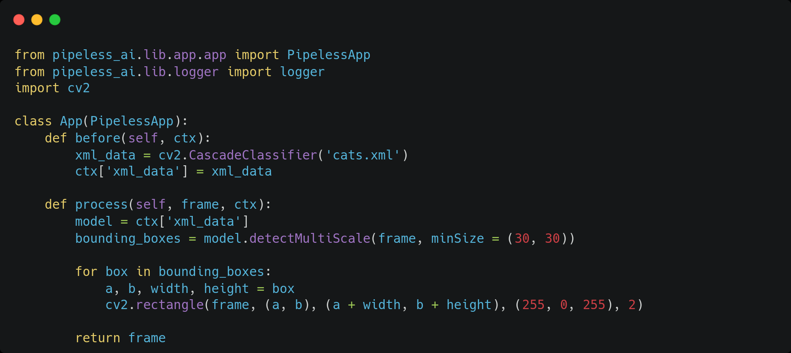

Pipeless is an open source multimedia framework with focus on computer vision.

With Pipeless, developers can create and deploy applications that analyze and manipulate audio and video in real time in just minutes, allowing them to focus on their applications instead of on creating and maintaining multimedia pipelines.

You can build applications in less than 15 lines of code thanks to the built-in models or you can easily bring your own models for complex use cases.

Pipeless run either locally or in the cloud and can be easily deployed thanks to our container images.

For example, you can build thing like:

https://github.com/miguelaeh/pipeless/assets/36923089/53012dea-5b82-44e4-9120-db90b9f11765

With just with these simple lines of code:



[](https://www.python.org/downloads/release/python-3100/)

## Index 📚

- [Requirements](#requirements-%EF%B8%8F)
- [Installation](#installation-%EF%B8%8F)
   - [Using Docker](#using-docker)
- [Getting started](#getting-started-)
   - [Create a Project](#create-a-project)
   - [Project Structure](#project-structure)
   - [Media Processing](#media-processing)
   - [Run Your App](#run-your-app)
   - [Configuration](#configuration)
- [Ready to use models](#ready-to-use-models)
   - [Tensorflow models](#tensorflow-based-models)
- [Current State](#current-state-)
- [Troubleshooting](#troubleshooting-)
- [Examples](#examples-)
- [Contributing](#contributing-)
- [License](#license-)

## Requirements ☝️

* Python (tested with version `3.10.12`)
* **Gstreamer 1.20.3**. Verify with `gst-launch-1.0 --gst-version`. Installation instructions [here](https://gstreamer.freedesktop.org/documentation/installing/index.html?gi-language=python)

### Note about macOS

The latest version of macOS (Ventura) comes with Python `3.9` by default. You can install version `3.10` with:

```console
brew install python
```

Also, to install Gstreamer in macOS use the following instead of the upstream instructions to ensure all the required packages are installed:

```console
brew install gstreamer
```

## Installation 🛠️

The following command installs the core (`pipeless-ai`) and the CLI (`pipeless-ai-cli`) into your system.

```console
pip install pipeless-ai pipeless-ai-cli
```

Test the installation with:

```console
pipeless --help
```

> NOTE: you may need to reload your shell for the new command to be available

### Using docker

Instead of installing locally, you can alternatively use docker and save the time of installing dependencies:

```console
docker run miguelaeh/pipeless --help
```

Find the whole container documentation [here](/package/README.md).

## Getting Started 🚀

We recommend reading the getting starting guide, however, you can also go directly to the [examples](examples) directory.

### Create a Project

Run the following command:

```console
pipeless create project <project-name>
```

By default, the above command will use an empty project template. You need to implement some functionality on it.

### Project structure

The `create project` command will create a directory under your project name with the following files:

* `app.py`: contains your `App` class. This file contains the implementation of your processing functions. For example, throwing inference on a CV model. Inot this file you will define the functions in charge of procesing the media frames.

* `config.yaml`: contains the configuration of the framework components. You can also override all configuration options via env vars starting with `PIPELESS_` followed by the config option name in capital letters.

### Media Processing

The processing steps are defined as methods of the `App` class. There are several processing stages that you can override:

#### Initial and final stages

These are represented by methods that are executed just once per stream.

They are tipically used when your app requires to execute some code before starting the processing or once the stream processing ends.

- `before`: contains code that is executed before processing any content from a stream
- `after`: contains code that is executed after the processing of a whole stream.

#### Processing stages

These are the stages that actually modify/learn/process the media streams. All of them receive a frame and **must** return a frame. The frames can be of any type(audio, video, text, metadata, ...).

- `pre_process`: code to execute to prepare a frame to be processed
- `process`: code for the actual frame processing
- `post-process`: code to execute after a frame is processed

These stages have been mainly defined for a proper logical code structure, there are no significant differences on how the code is executed on them.

#### Context

You app can maintain its own internal state. This is useful when you need to pass information between stages.

By default, an internal context is created and can be accessed via the `ctx` variable.

You can also define your own variables within the `App` class, however, note that if you override the constructor the context won't be initialized properly.

### Run Your App

To test your app execute the following from your app directory:

```console
pipeless run <component>
```

`<component>` must be one of `input`, `worker`, `output`, `all` (default).

When running your application locally, simply use `all` and everything will run automatically on the proper order.

#### Core Components

Pipeless has been designed for easy local execution but more important, to easily deploy to the cloud. Thus, it is split in 3 main components:

* `input`: Receives the media streams, demux and decode the streams.
* `worker`: Receives raw media frames, and processes them according to the user app. You can deploy any number of workers and the processing will be load balanced automatically using a round robin schedule. When deployed to the cloud this allows to reach **real time** processing even with each frame takes relatively long times to process. Note in that case, that each worker executes the `before` and `after` stages and that each worker has a different instance of the running app context.
* `output`: Receives the processed raw media frames, encodes and mux them into the proper container format for the output protocol provided by the user

Each component runs with independence of the others.

### Configuration

To configure your app you can use either env vars or the config file (`config.yaml`).

| Option | Description | Value(s)/Type | Env Var |
| ------ | ----------- | ------------- | ------- |
| `log_level` | Level of the logging|  `DEBUG`, `INFO`, `WARN`, `ERROR` | `PIPELESS_LOG_LEVEL` |
| `input.address.host` | Host where the input component is running | `localhost` (string) | `PIPELESS_INPUT_ADDRESS_HOST` |
| `input.address.port` | Port of the input component process | `1234` (int) | `PIPELESS_INPUT_ADDRESS_PORT` |
| `input.video.enable` | Whether to enable to video input | `true` (boolean) | `PIPELESS_INPUT_VIDEO_ENABLE` |
| `input.video.uri`    | Uri of the input video to process or `v4l2` to use device webcam/tv card. URIs **Must** include the protocol (`file://`, `https://`, `rtmp://`, etc) | string | `PIPELESS_INPUT_VIDEO_URI` |
| `output.address.host` | Host where the output component is running | `localhost` (string) | `PIPELESS_OUTPUT_ADDRESS_HOST` |
| `output.address.port` | Port of the output component process | `1234` (int) | `PIPELESS_OUTPUT_ADDRESS_PORT` |
| `output.video.enable` | Whether to enable to video output | `true` (boolean) | `PIPELESS_OUTPUT_VIDEO_ENABLE` |
| `output.video.uri`    | `screen` to see video directly on the device screen, or the URI where to send the processed output video. URIs **must** include the protocol (`file://`, `https://`, `rtmp://`, etc) | string | `PIPELESS_OUTPUT_VIDEO_URI` |
| `output.recv_buffer_size` | Size of the output socket reception buffer | `300` (int) | `PIPELESS_OUTPUT_RECV_BUFFER_SIZE` |
| `worker.recv_buffer_size` | Size of the worker socket reception buffer | `300` (int) | `PIPELESS_WORKER_RECV_BUFFER_SIZE` |
| `worker.n_workers` | Number of workers deployed | int | `PIPELESS_WORKER_N_WORKERS` |

When using remote input **and** output video URIs, Pipeless will run as daemon (it will never stop) and it will process any number of consecutive streams that appear on the remote URI.

## Ready to use models

We provide some modules containing a growing set of ready to use models for common cases. You can use them to develop your applications as fast as writing a couple lines of code. Each module has its own documentation, and the whole set of modules can be found [here](/models/README.md).

### Tensorflow based models

* [Multi-pose estimation](/models/tensorflow/src/pipeless_ai_tf_models/multi_pose_estimation/): Detects up to 6 people. Returns bounding boxes for the people and 17 keypoints (nose, left eye, right eye, left ear, ...)

## Current state 📌

Pipeless is in an alpha state. Below you can find the fields currently supported as well as the formats and protocols.

### Computer vision / video processing

For the input media we support almost any protocol and format (with several codecs). If you need a format that is not supported we appreacite the opening of a feature request or pull request.

Supported input protocols: `v4l2` (for device webcam), `file`, `http(s)`, `rtmp`, `rtsp`, `rtp`, `tcp`, `udp`, `ftp`, ...
Supported input formats: `mp4`, `webm`, `mkv`, ... (several codecs supported for all of them)

The following table describes the supported output protocols and formats. New output protocols and formats are added constantly. 

| Output Protocol | Output Format
| --------------- | ------------- |
| `screen`        | `raw` (Directly shown on the device screen) |
| `file`          | `mp4`         |
| `rtmp`          | `flv`         |

> NOTE: When using `v4l2` as input URI to read from device webcam, the output URI **must** be `screen`.

> IMPORTANT: `v4l2` as input is supported in core versions >= `0.1.3-alpha`

> Feel free to contribute with new formats. You can also request a new one by opening an issue specifying `Feature Request` on the title and telling us what you need inlcuding an explanation of your use case. 

### Audio recognition / audio processing

Audio processing is being implemented, however, not yet ready.

## Troubleshooting 🐞

* If the pipeline doesn't start and there is not apparent error even on the debug logs run the following command changing `<path>` by your file path:

```console
GST_DEBUG="*:3,GstVaapiPostproc:7,GstGLUploadElement:7" gst-launch-1.0 uridecodebin uri=<path>.mp4 ! glimagesink
```

If you find errors or warnings on the output related to hardware acceleration it may be due to a GStreamer bug. Remove the `gstreamer1.0-vaapi` package and it should work:

```console
apt-get remove gstreamer1.0-vaapi
```

## Examples 🌟

We provide some working applications under the `examples` directory, so you can easily run and play with them.

- [Text Overlay](examples/text-overlay)
- [Cats face recognition](examples/cats)

## Contributing 🤝

Thanks for your interest in contributing! Contributions are welcome and encouraged. While we're working on creating detailed contributing guidelines, here are a few general steps to get started:

1. Fork this repository.
2. Create a new branch: `git checkout -b feature-branch`.
3. Make your changes and commit them: `git commit -m 'Add new feature'`.
4. Push your changes to your fork: `git push origin feature-branch`.
5. Open a pull request describing your changes.

We appreciate your help in making this project better!

Please note that for major changes or new features, it's a good idea to discuss them in an issue first so we can coordinate efforts.

## License 📄

This project is licensed under the [Apache License 2.0](LICENSE).

### Apache License 2.0 Summary

The Apache License 2.0 is a permissive open-source license that allows you to use, modify, and distribute this software for personal or commercial purposes. It comes with certain obligations, including providing attribution to the original authors and including the original license text in your distributions.

For the full license text, please refer to the [Apache License 2.0](LICENSE).

## Notable Changes

### Core version `0.1.6` and CLI version `0.1.5`

These versions include a new **optional** parameter to configure the reception buffers of the sockets, which is useful to adjust the buffer sizes to the processing time.

With the above change, we also moved the **n_workers** option to the `worker` configuration section, which constitutes a **breaking change**. Since Pipeless is still in alpha, we are not increasing the major version.
